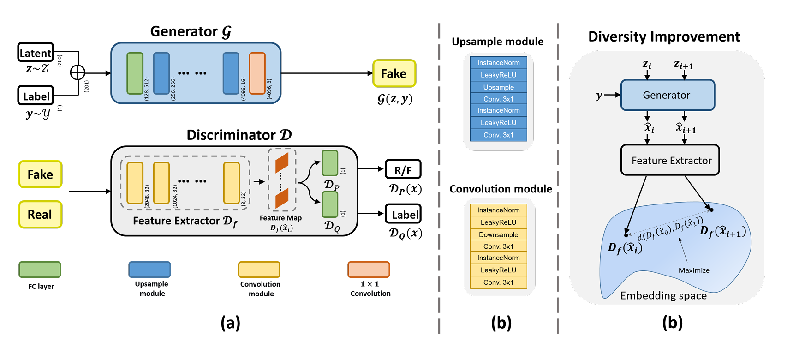

# ConSeisGen: Controllable Synthetic Seismic Waveform Generation

<p align="center">
  
</p>

<p align="center">
  <a href="https://ieeexplore.ieee.org/document/10339272">
    
  </a>
</p>

[](https://www.python.org/downloads/)
[](https://pytorch.org/)

This repository contains the official implementation of **ConSeisGen**, a controllable generative adversarial network (GAN) framework for generating realistic seismic waveforms conditioned on a continuous physical parameter such as epicentral distance.

> **Paper Reference:**  
> **Li, Y., Yoon, D., Ku, B., & Ko, H. (2023).**  
> *ConSeisGen: Controllable Synthetic Seismic Waveform Generation.* IEEE Geoscience and Remote Sensing Letters, 21, 1–5.  
> [IEEE Link (DOI: 10.1109/LGRS.2023.3342801)](https://doi.org/10.1109/LGRS.2023.3342801)


---

## 📁 Project Structure

```bash
ConSeisGen/
├── configs/         # YAML or JSON files for experiment configs
├── logs/            # Training logs
├── outputs/         # Generated waveform outputs, model checkpoints
├── networks.py      # Model definitions (Generator, Discriminator, blocks)
├── train.py         # Training entry point
├── inference.py     # Inference code
├── trainer.py       # Training loops and loss functions
└── utils.py         # Dataset loading, metrics, and utility functions
```

---

## ⚙️ Installation

1. Clone the repository:
```bash
git clone https://github.com/YOUR_USERNAME/ConSeisGen.git
cd ConSeisGen
```

2. Install dependencies:
```bash
pip install -r requirements.txt
```

---

## 🚀 Quick Start

Run the training with a configuration file:
```bash
python train.py --config configs/default.yaml
```

Generated samples and model checkpoints will be saved in `outputs/`.

---

## 🧠 Model Overview

The generator `SeisGen_ACGAN_real_dist` takes as input:
- A random noise vector (e.g. Gaussian)
- A continuous condition (e.g., distance in km)

It outputs:
- A waveform tensor of shape `(batch_size, 3, sequence_length)`

The discriminator predicts both:
- Real/Fake label (adversarial output)
- The input condition (auxiliary regression)

---

## 📊 Results

The proposed method demonstrates improved control over synthetic waveform properties while preserving realism, outperforming conventional GANs in both visual and statistical metrics. See the full paper for quantitative evaluations.

---

## 📷 Sample Output

Below is an example of a generated synthetic seismic waveform using the ConSeisGen model:

<p align="center">
  
</p>

---

## 📝 Citation
If you use this work in your research, please cite:

```bibtex
@article{li2023conseisgen,
  title={ConSeisGen: Controllable Synthetic Seismic Waveform Generation},
  author={Li, Yuanming and Yoon, Doyoung and Ku, Byoungjoo and Ko, Hanseok},
  journal={IEEE Geoscience and Remote Sensing Letters},
  volume={21},
  pages={1--5},
  year={2023},
  publisher={IEEE}
}
```

---

## 📬 Contact
For questions or collaborations, feel free to contact:
- Yuanming Li: [lym7499500@gmail.com](mailto:lym7499500@gmail.com)

---

## ⚡ Inference

The `inference.py` script generates synthetic seismic waveforms using a trained ConSeisGen (ACGAN) model.

### Basic Usage

```bash
python inference.py \
    --config configs/seismo.yaml \
    --model_path /path/to/your/trained_generator.pt \
    --output_dir ./generated_waveforms \
    --num_samples 20 \
    --magnitude 5.0
```

### Arguments

-   `--config`: Path to the model configuration file (e.g., `configs/seismo.yaml`). This file contains parameters used during the model's training, such as generator architecture details.
-   `--model_path`: Path to the saved generator model checkpoint (`.pt` file). This should be a checkpoint from a trained ConSeisGen model.
-   `--output_dir`: Directory where the generated waveform `.npy` files will be saved. Each waveform is saved as a separate NumPy file.
-   `--num_samples`: (Optional) Number of waveforms to generate. Defaults to 10.
-   `--magnitude`: (Optional) Target magnitude for the generated waveforms. This is the conditional input to the generator. Defaults to 4.5.
-   `--device`: (Optional) Device to run the inference on, e.g., 'cpu' or 'cuda'. If not specified, it defaults to 'cuda' if a CUDA-enabled GPU is available, otherwise 'cpu'.
```
